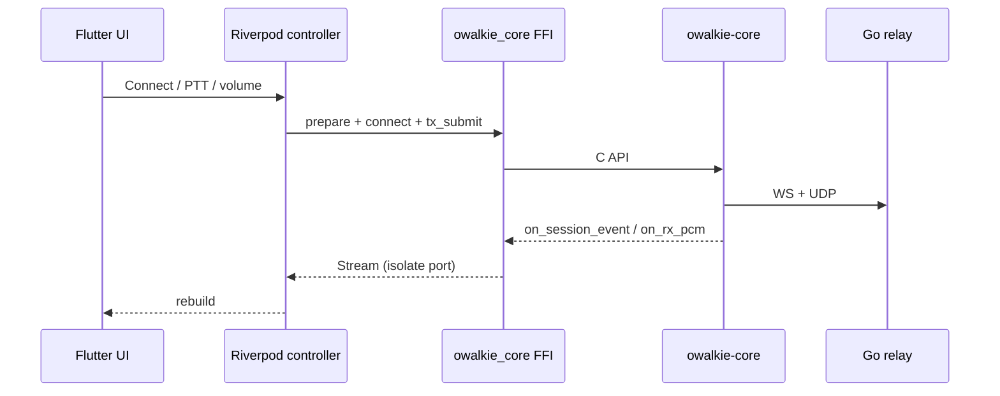

# O-Walkie Flutter client — architecture (experiment)

## Layout

```
flutter-client/
  lib/                    # Dart UI + orchestration (single codebase)
  packages/owalkie_core/  # FFI plugin → ../../../owalkie-core (C/C++)
  ARCHITECTURE.md
```

Go relay and `owalkie-core` protocol stay unchanged.

## Layers (target)

| Layer | Package / location | Responsibility |
|-------|-------------------|----------------|
| **UI** | `lib/features/*` | Screens, widgets, accessibility |
| **App state** | `flutter_riverpod` | View models, connection/PTT state |
| **Domain** | `lib/domain/` *(next)* | Server profiles, scan policy, PTT rules |
| **Relay session** | `packages/owalkie_core` | FFI to `owalkie_prepare_connection`, `connect`, `tx_submit`, callbacks |
| **Platform** | Future plugins | Audio I/O, FGS, hotkeys, BT route |

## Plugin: `owalkie_core`

- **Now:** session transport + miniaudio RX/TX in native code; Dart **background isolate** (`session_worker.dart`) owns all FFI calls; UI talks via `SessionService` + `SendPort`.
- **Android (default):** utilities-only (`OWALKIE_CORE_BUILD_SESSION=OFF`) so the shell APK builds without vcpkg NDK deps. Full session: run `android/scripts/build-ndk-deps.ps1`, then build with `OWALKIE_FLUTTER_FULL_SESSION=ON`.
- **Windows (default):** utilities-only until `vcpkg install boost-beast opus --triplet x64-windows`; then set session ON in `src/CMakeLists.txt` or add a similar env flag.
- **Next:** extend `ffigen` to `include/owalkie_core.h` managed-session API; register native callbacks → Dart `SendPort` (dedicated isolate, mirror `NativeRelayBridge`).

Suggested future plugins (pub.dev):

| Need | Plugin direction |
|------|------------------|
| Profiles / settings | `shared_preferences` |
| Deep links `owalkie://` | `app_links` |
| Share/import connection | `share_plus`, `clipboard` |
| Android FGS + wake | `flutter_foreground_task` or thin Kotlin service + channel |
| Low-latency audio | custom `owalkie_audio` plugin (AudioRecord/Track, WASAPI) |
| Windows global PTT | custom `owalkie_hotkey` (LL hook) |
| i18n | `flutter gen-l10n` (replace `app_strings.dart`) |
| Settings / about | `package_info_plus`, `url_launcher` |

## Session flow (planned)



Audio path: **do not** decode/play PCM on UI isolate — native callback → audio plugin queue (same as `WalkieService` + `AudioTrack`).

## Parity map (Kotlin → Flutter)

| Kotlin | Flutter (planned) |
|--------|-------------------|
| `WalkieService` | `SessionOrchestrator` (Dart) + `owalkie_platform` plugin |
| `NativeRelayBridge` | `packages/owalkie_core` Dart facade |
| `MainActivity` | `HomeScreen` |
| `SettingsActivity` | `SettingsScreen` + `go_router` |
| `ServerStore` | `shared_preferences` + `domain/server_profile.dart` |

## Build

```powershell
$env:Path = "C:\dev\flutter\bin;C:\dev\jdk\bin;" + $env:Path
$env:ANDROID_HOME = "C:\dev\android-sdk"
cd D:\progworkspace\Vibecoding\O-Walkie\flutter-client
flutter pub get
flutter build apk --debug
flutter build windows
```

Android NDK deps: same as Kotlin client (`android/scripts/build-ndk-deps.ps1` if vcpkg triplets missing).
